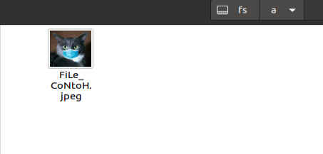
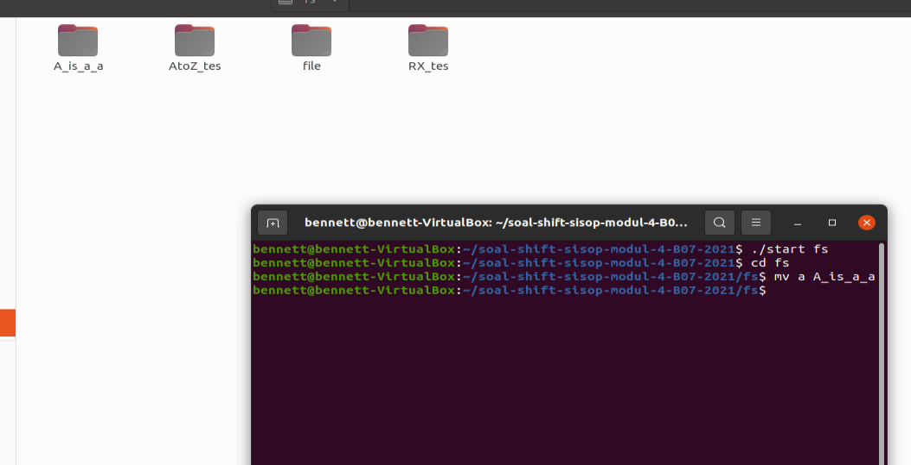
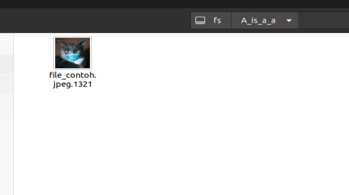
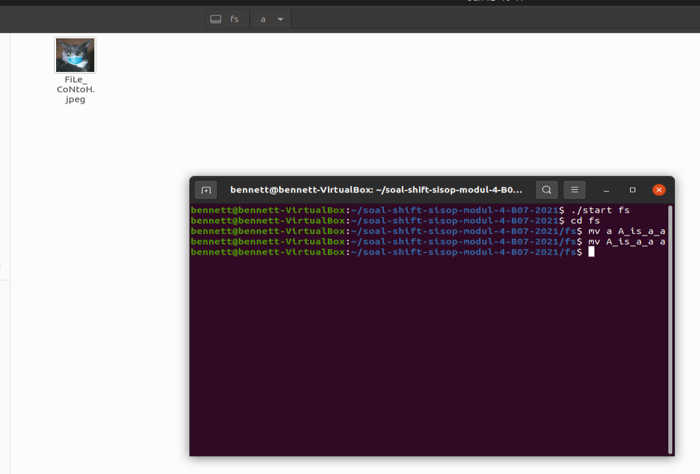
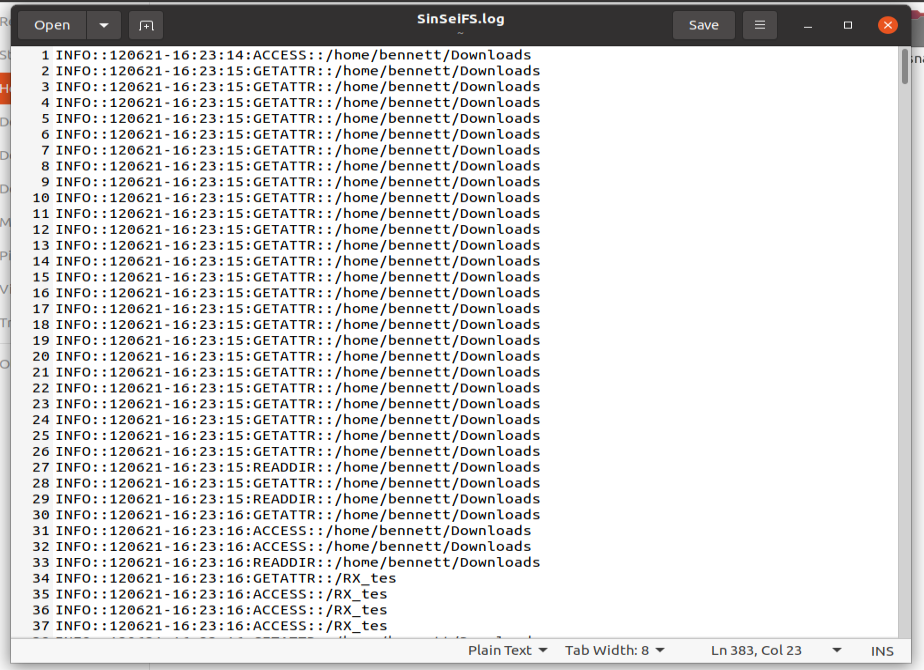

# soal-shift-sisop-modul-3-B07-2021
## Anggota Kelompok
* Christian Bennett Robin 05111940000078
* Zelda Elma Sibuea 05111940000038
* Hanifa Fauziah 05111940000024

## Soal 1

## Soal 2

## Soal 3

Melakukan enkripsi dan dekripsi jika direktori dibuat dan diberi nama atau direname dengan awalan `A_is_a`.

Pertama mendapatkan angka biner nya menggunakan fungsi berikut: 

```c
void getBinary(char *fname, char *bin, char *lowercase)
{
    int endId = (fname);
    int startId = slashId(fname, 0);
    int i;

    for (i = startId; i < endId; i++)
    {
        if (isupper(fname[i]))
        {
            bin[i] = '1';
            lowercase[i] = fname[i] + 32;
        }
        else
        {
            bin[i] = '0';
            lowercase[i] = fname[i];
        }
    }
    bin[endId] = '\0';

    for (; i < strlen(fname); i++)
    {
        lowercase[i] = fname[i];
    }
    lowercase[i] = '\0';
}
```

Lalu angka biner tersebut diubah menjadi decimal.
 
```c
int convertBinToDec(char *bin)
{
    int tmp = 1, res = 0;
    for (int i = strlen(bin) - 1; i >= 0; i--)
    {
        if (bin[i] == '1')
            res += tmp;
        tmp *= 2;
    }
    return res;
}
```

Lalu kita gunakan di fungsi enkripsi untuk diappend pada nama file.

```c
void encryptBinary(char *fpath)
{
	chdir(fpath);
	DIR *dp;
	struct dirent *dir;
	struct stat st;
	dp = opendir(".");
	if (dp == NULL)
		return;

	char dirPath[1000];
	char filePath[1000];
	char filePathBinary[1000];

	while ((dir = readdir(dp)) != NULL)
	{
		if (stat(dir->d_name, &st) < 0)
			;
		else if (S_ISDIR(st.st_mode))
		{
			if (strcmp(dir->d_name, ".") == 0 || strcmp(dir->d_name, "..") == 0)
				continue;
			sprintf(dirPath, "%s/%s", fpath, dir->d_name);
			encryptBinary(dirPath);
		}
		else
		{
			sprintf(filePath, "%s/%s", fpath, dir->d_name);
			char bin[1000], lowercase[1000];
			getBinary(dir->d_name, bin, lowercase);
			int dec = binToDec(bin);
			sprintf(filePathBinary, "%s/%s.%d", fpath, lowercase, dec);
			rename(filePath, filePathBinary);
		}
	}
	closedir(dp);
}
```

Untuk dekripsi langkah-langkahnya sama, namun kali ini dari desimal ke biner. Lalu untuk setiap angka desimal yang berbeda, besar/ kecilnya huruf juga diubah seperti kondisi awal.

```c
int convertDec(char *ext)
{
    int dec = 0, pengali = 1;
    for (int i = strlen(ext) - 1; i >= 0; i--)
    {
        dec += (ext[i] - '0') * pengali;
        pengali *= 10;
    }
    return dec;
}

void convertDecToBin(int dec, char *bin, int len)
{
    int idx = 0;
    while (dec)
    {
        if (dec & 1)
            bin[idx] = '1';
        else
            bin[idx] = '0';
        idx++;
        dec /= 2;
    }
    while (idx < len)
    {
        bin[idx] = '0';
        idx++;
    }
    bin[idx] = '\0';

    for (int i = 0; i < idx / 2; i++)
    {
        char tmp = bin[i];
        bin[i] = bin[idx - 1 - i];
        bin[idx - 1 - i] = tmp;
    }
}

void getDecimal(char *fname, char *bin, char *normalcase)
{
    int endId = (fname);
    int startId = slashId(fname, 0);
    int i;

    for (i = startId; i < endId; i++)
    {
        if (bin[i - startId] == '1')
            normalcase[i - startId] = fname[i] - 32;
        else
            normalcase[i - startId] = fname[i];
    }

    for (; i < strlen(fname); i++)
    {
        normalcase[i - startId] = fname[i];
    }
    normalcase[i - startId] = '\0';
}

void decryptBinary(char *fpath)
{
	chdir(fpath);
	DIR *dp;
	struct dirent *dir;
	struct stat st;
	dp = opendir(".");
	if (dp == NULL)
		return;

	char dirPath[1000];
	char filePath[1000];
	char filePathDecimal[1000];

	while ((dir = readdir(dp)) != NULL)
	{
		if (stat(dir->d_name, &st) < 0)
			;
		else if (S_ISDIR(st.st_mode))
		{
			if (strcmp(dir->d_name, ".") == 0 || strcmp(dir->d_name, "..") == 0)
				continue;
			sprintf(dirPath, "%s/%s", fpath, dir->d_name);
			decryptBinary(dirPath);
		}
		else
		{
			sprintf(filePath, "%s/%s", fpath, dir->d_name);
			char fname[1000], bin[1000], normalcase[1000], clearPath[1000];

			strcpy(fname, dir->d_name);
			char *ext = strrchr(fname, '.');
			int dec = convertDec(ext + 1);
			for (int i = 0; i < strlen(fname) - strlen(ext); i++)
				clearPath[i] = fname[i];

			char *ext2 = strrchr(clearPath, '.');
			decToBin(dec, bin, strlen(clearPath) - strlen(ext2));
			getDecimal(clearPath, bin, normalcase);
			sprintf(filePathDecimal, "%s/%s", fpath, normalcase);
			rename(filePath, filePathDecimal);
		}
	}
	closedir(dp);
}
```

Berikut merupakan kondisi awal dari direktori `a`:



Lalu dilakukan encode dengan cara melakukan rename dengan command `mv a A_is_a_a`:



Setelah nama direktori diubah dengan awalan `A_is_a_`, isinya pun terenkode seperti permintaan soal: 



Lalu untuk decode, direktori direname kembali menjadi `a`dengan command `mv A_is_a_a a`, lalu hasilnya kembali menjadi seperti kondisi semula sebagai berikut:



### Kesulitan ###
Karena pada awalnya program tidak bisa di run, maka kami kesulitan untuk bagaimana cara jalannya program. Selain itu terdapat juga kesulitan pada saat ingin mengconvert string untuk fungsi biner dan desimalnya saat ingin diappend ke nama direktori. Pengimplementasian fungsi dan parameter yang dibutuhkan juga sangat membingungkan dikarenakan resource informasi yang kurang.

## Soal 4

Membuat log file dengan format sebagai berikut: 

[Level]::[dd][mm][yyyy]-[HH]:[MM]:[SS]:[CMD]::[DESC :: DESC]

Level : Level logging, dd : 2 digit tanggal, mm : 2 digit bulan, yyyy : 4 digit tahun, HH : 2 digit jam (format 24 Jam),MM : 2 digit menit, SS : 2 digit detik, CMD : System Call yang terpanggil, DESC : informasi dan parameter tambahan

INFO::28052021-10:00:00:CREATE::/test.txt 
INFO::28052021-10:01:00:RENAME::/test.txt::/rename.txt

```c
void logFile(char *level, char *command, const char *desc[], int descLen)
{
    FILE *f = fopen(logPath, "a");
    time_t t;
    struct tm *tmp;
    char timeString[100];

    time(&t);
    tmp = localtime(&t);
    strftime(timeString, sizeof(timeString), "%d%m%y-%H:%M:%S", tmp);

    fprintf(f, "%s::%s:%s", level, timeString, command);
    for (int i = 0; i < descLen; i++)
    {
        fprintf(f, "::%s", desc[i]);
    }
    fprintf(f, "\n");

    fclose(f);
}
```

Pembuatan log file dilakukan dengan cara seperti atas. Pertama-tama fungsi membuat file logPath yang sudah terdefinisi di awal yaitu:  `static const char *logPath = "/home/USER/SinSeiFS.log";`. Lalu dilakukan pemanggilan fungsi time untuk menginisialisasi waktu, lalu format output menyesuaikan soal. Disini kami menambahkan parameter `int descLen`, yaitu sebagai parameter jumlah argumen agar tidak perlu membuat fungsi baru yang banyak argumennya lebih dari satu.

Berikut merupakan isi dari log file yang kami buat: 



### Kesulitan ###

Pertama kebingungan karena formatnya bisa beda tergantung jumlah argumen, akhirnya ditambahkan parameter baru untuk panjang argumennya.

